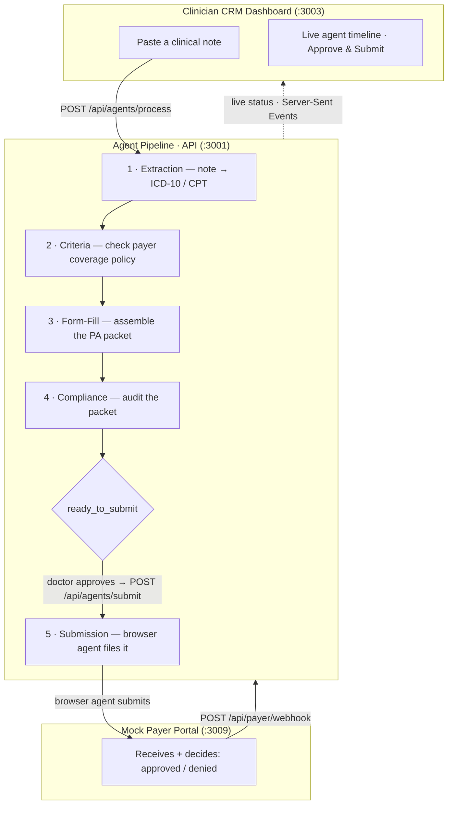

# ClearAuth 🩺

### Autonomous Prior-Authorization Agent for Clinicians — Clinical Note to Filed PA in One Pass

> **Team:** Shanay Gaitonde · Sahiel Bose · Pranav Achar &nbsp;·&nbsp; Multi-agent systems · TypeScript · LangChain

[](https://nextjs.org)
[](https://typescriptlang.org)
[](https://turbo.build)
[](https://langchain.com)
[](#api-reference)
[](#runs-with-zero-configuration)
[](LICENSE)

A doctor pastes a clinical note. An agent pipeline reads it, looks up the payer's coverage criteria,
assembles the payer's prior-authorization packet, runs a compliance audit, and — once the physician
approves — submits it through a **browser agent** and tracks the decision live. Every step streams to
a CRM dashboard in real time, and **the whole thing runs end-to-end with zero API keys**.

---

## The Demo: Why This Matters

Prior authorization is the paperwork tax on American medicine — a physician spends roughly **13 hours a week** getting insurers to approve care they've already decided is necessary. Every payer has a different form, a different portal, and a different set of coverage criteria. ClearAuth turns that whole loop into a single agent that acts on the doctor's behalf.

1. **Dr. Demo pastes a note:** *"Jane Doe, 54F, Aetna — chronic lower back pain, failed 8 weeks of PT and NSAIDs, persistent radicular symptoms. Requesting MRI lumbar spine without contrast."*
2. The **Extraction** agent structures it: diagnosis, **ICD-10 `M54.5`**, requested treatment, **CPT `72148`**, payer, and patient.
3. The **Criteria** agent looks up Aetna's coverage policy for lumbar MRI and checks each requirement — *conservative therapy documented? ✓ duration met? ✓* — and reports which criteria are satisfied.
4. The **Form-Fill** agent assembles the completed PA packet and stores it.
5. The **Compliance** agent audits the packet — required fields present, codes valid, no missing justification — and returns a pass/warn/fail verdict.
6. The pipeline **stops at `ready_to_submit`**. This is a deliberate **human-in-the-loop gate**: the AI proposes, the clinician signs off. Dr. Demo reviews the packet in the CRM and clicks **Approve & Submit**.
7. The **Submission** agent drives a **browser agent** to file the packet on the payer's portal and captures a confirmation ID.
8. A payer webhook flips the request to `under_review → approved`, and the dashboard animates the whole journey live the entire time.

> **ClearAuth collapses a multi-day, multi-portal paperwork loop into one reviewed-and-filed pass — the doctor writes the note and signs off; the agents do everything in between.**

---

## Architecture

Three Next.js apps in one monorepo. The autonomous agents run through the compliance check, then **hand control back to a human** before anything is submitted to the payer.



**Engineering ideas worth a second look:**

- **Fail-soft by design** — every external call is wrapped in a `try/catch` with a timeout and a deterministic fallback, so a missing key or a flaky API never blocks the pipeline. The demo never breaks (see [below](#runs-with-zero-configuration)).
- **Human-in-the-loop gate** — the pipeline halts at `ready_to_submit` and waits for explicit physician approval. Nothing reaches the payer without a human signing off.
- **Live everything** — each pipeline transition is persisted and broadcast over **Server-Sent Events**, so connected dashboards animate the agent timeline as it runs.
- **Tamper-evident audit** — every step appends an `AuditEntry` carrying a **SHA-256 checksum** over its own contents, verifiable after the fact.
- **One LLM seam** — all model access goes through a single `createChatModel()` factory (Anthropic **or** Gemini); with no key it returns `null` and every agent uses its rule-based fallback.

---

## The Agent Pipeline

`runPipeline(authRequest)` runs four autonomous agents in sequence — persisting status + an audit entry after **every** step (which pushes a live SSE update) — then stops at the human approval gate. The fifth agent runs only after the doctor approves.

| # | Agent | What it does | Integration |
|---|-------|--------------|-------------|
| 1 | **Extraction** | Clinical note → patient, diagnosis, ICD-10, CPT, justification | LLM (Claude/Gemini) → regex fallback |
| 2 | **Criteria** | Look up the payer's coverage policy; check each requirement | Apify → canned policy fallback |
| 3 | **Form-Fill** | Assemble + store the completed PA packet | Tigris → in-memory fallback |
| 4 | **Compliance** | Audit the packet (fields, codes, justification) → pass/warn/fail | Opsera (MCP) → rule-based fallback |
| — | 🧑‍⚕️ **Human approval gate** | Doctor reviews the packet in the CRM and clicks **Approve & Submit** | — |
| 5 | **Submission** | Drive a browser agent to file the packet on the payer portal | Rtrvr.ai → simulated submit fallback |

**Status lifecycle:**

```
intake → extracting → checking_criteria → filling_form → compliance_review
       → ready_to_submit → [human approval] → submitting → submitted
       → under_review → approved | denied        (any failure → error, never a crash)
```

---

## Runs With Zero Configuration

```bash
npm install && npm run dev
```

…boots the API + dashboard (and the mock payer portal) and runs the **entire** pipeline on deterministic mocks with **no `.env` file**. Every integration follows one rule — *fail soft*:

```ts
// Real call behind a key + timeout; deterministic fallback otherwise. Never block the pipeline.
export async function storeObject(key: string, body: string) {
  if (tigrisConfigured()) {
    try { /* REAL: PUT the object to Tigris, return its URL */ }
    catch (err) { console.warn("[tigris] falling back:", err); }
  }
  return mockStore(key, body); // in-memory — the demo never breaks
}
```

Drop a real key into `.env` and that integration activates automatically — no code changes. A bad or expired key never crashes anything; the call is wrapped in `try/catch` with a timeout and falls back to the mock. The same applies to the LLM: with no `ANTHROPIC_API_KEY`/`GEMINI_API_KEY`, every agent uses a rule-based fallback and still returns a complete result.

---

## Quick Start

```bash
git clone https://github.com/shanayg15/ClearAuth.git
cd ClearAuth
npm install
cp .env.example .env     # leave everything blank → all integrations mock
npm run dev              # boots every app (Turborepo)
```

Open **http://localhost:3003**, click **Sample Note**, then **Run Pipeline**, and watch it walk to `ready_to_submit`. Review the packet, click **Approve & Submit**, and watch it reach `submitted`.

| App | URL | Who uses it |
|-----|-----|-------------|
| **API** | http://localhost:3001 | Internal — the agent pipeline + all routes |
| **Dashboard** | http://localhost:3003 | The clinician CRM — paste a note, watch the pipeline, approve & submit |
| **Payer Portal** | http://localhost:3009 | The mock insurer form the browser agent submits to |

| Command | What it does |
|---------|--------------|
| `npm run dev` | run every app (Turborepo) |
| `npm run dev:api` / `npm run dev:dashboard` | run a single app |
| `npm run type-check` | `tsc --noEmit` across the monorepo |
| `npm run lint` | ESLint across the monorepo |
| `npm run build` | production build of every app |

---

## API Reference

Auth is a demo no-op — every request resolves to a single demo doctor, so a token is optional (`Authorization: Bearer demo_doctor`).

### `POST /api/auth-requests` — create a request from a clinical note

```bash
curl -X POST http://localhost:3001/api/auth-requests \
  -H "Content-Type: application/json" \
  -d '{ "rawNote": "Jane Doe, 54F, Aetna — chronic lower back pain, failed 8 weeks PT, requesting MRI lumbar spine without contrast" }'
```

Returns a new `AuthRequest` with `status: "intake"` and an `id`.

### `POST /api/agents/process` — run the autonomous pipeline (agents 1–4)

```bash
curl -X POST http://localhost:3001/api/agents/process \
  -H "Content-Type: application/json" \
  -d '{ "id": "<authRequestId>" }'
```

```jsonc
{
  "request": {
    "id": "…",
    "status": "ready_to_submit",          // stops at the human approval gate
    "extraction": { "diagnosis": "Chronic lower back pain", "icd10": "M54.5", "cptCode": "72148", "payer": "Aetna", "patient": { "name": "Jane Doe", "insurer": "Aetna" } },
    "criteria":   { "allMet": true, "requiredCriteria": [ { "label": "Conservative therapy ≥ 6 weeks", "met": true } ] },
    "formFill":   { "packetKey": "packets/<id>.md", "formFields": { /* … */ } },
    "compliance": { "overall": "pass", "checks": [ /* … */ ], "source": "fallback" },
    "auditTrail": [ { "agentRole": "extraction-agent", "action": "extract_clinical_data", "checksum": "…" } ]
  }
}
```

### `POST /api/agents/submit` — file it (agent 5), after the doctor approves

```bash
curl -X POST http://localhost:3001/api/agents/submit \
  -H "Content-Type: application/json" \
  -d '{ "id": "<authRequestId>" }'
```

Drives the browser agent to submit on the payer portal and returns the request at `status: "submitted"` with a `submission.confirmationId`.

### Other routes

| Route | Purpose |
|-------|---------|
| `GET /api/auth-requests` · `GET /api/auth-requests/:id` | List all requests / fetch one |
| `GET /api/stream` | **SSE** feed — a `snapshot` on connect, then an `upsert` event on every change |
| `POST /api/payer/webhook` | Payer status callback (`under_review → approved \| denied`) |
| `GET /api/compliance` | Opsera-backed compliance audit |

---

## Tech Stack

| Layer | Technology |
|-------|------------|
| Monorepo | Turborepo + npm workspaces |
| Framework | Next.js 15 (App Router), React 19 |
| Language | TypeScript 5 (strict everywhere) |
| Agents / LLM | LangChain + Claude **or** Gemini, via a single `createChatModel()` factory |
| Realtime | Server-Sent Events (live agent timeline) |
| Coverage scraping | Apify |
| Object storage | Tigris (notes + generated PA packets) |
| Compliance audit | Opsera (MCP) |
| Browser submission | Rtrvr.ai |
| Database | Supabase (optional; in-memory store by default) |
| Audit | Per-entry SHA-256 checksums |
| Deployment | Render (`render.yaml` blueprint) |

---

## Project Structure

```
ClearAuth/
├── apps/
│   ├── api/            # :3001 — the agent pipeline + all routes
│   │   └── src/
│   │       ├── agents/         # pipeline.ts + the 5 chains (extraction, criteria, …)
│   │       ├── app/api/        # auth-requests, agents/process, agents/submit, stream, …
│   │       └── lib/            # tigris, rtrvr, opsera, store, audit, chat-model-factory
│   ├── dashboard/      # :3003 — the clinician CRM (live timeline, compliance panel, payer intel)
│   └── payer-portal/   # :3009 — the mock insurer form the browser agent submits to
├── packages/
│   ├── types/          # shared TypeScript contract — import from "@clearauth/types"
│   └── supabase/       # Supabase client helpers
├── render.yaml         # Render Blueprint: 3 web services
└── .env.example        # every integration key, blank
```

---

## Reliability & Trust

ClearAuth handles a high-stakes clinical workflow, so its design leans on guarantees rather than luck:

- **The demo never breaks.** Every integration fails soft to a deterministic mock; with zero keys the full pipeline still runs end-to-end. A failed step flips status to `error` and stops — `runPipeline` never throws.
- **A human always signs off.** The autonomous agents stop at `ready_to_submit`; nothing is filed with the payer until a physician explicitly approves.
- **Every action is auditable.** Each step appends an `AuditEntry` with a SHA-256 checksum over its contents (`verifyAuditEntry()` re-derives and checks it), so the compliance trail is tamper-evident.
- **Strict types, enforced.** TypeScript strict across the monorepo; `npm run type-check`, `npm run lint`, and `npm run build` are the quality gates.

---

## Deployment

A [`render.yaml`](render.yaml) blueprint deploys all three apps as Render web services from the one monorepo. Each builds from the repo root (so the `@clearauth/*` workspace packages link) and binds to Render's `$PORT`; every integration key is declared `sync: false` so the apps deploy and run on mocks out of the box. After the first deploy, fill in the cross-service URLs (API URL into each frontend's `NEXT_PUBLIC_API_URL`, and the payer-portal URL into the API's `RTRVR_PORTAL_URL`).

---

## License

[MIT](LICENSE) — © 2026 Shanay Gaitonde, Sahiel Bose, Pranav Achar
